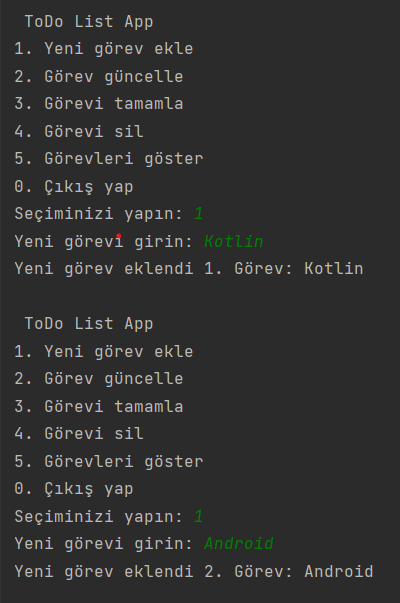
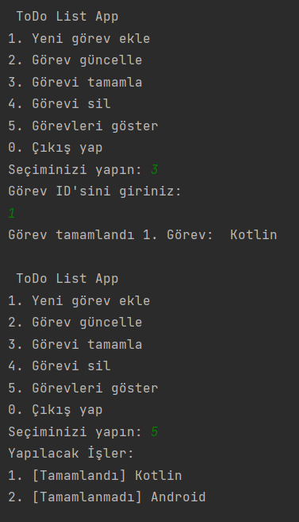

ToDO List

Bu uygulamada classlar'da data class yapısıyla birlikte fonksiyonları kullanarak kullanıcının yapılacak işleri ekleyebileceği, düzenleyebileceği ve silebileceği
basit bir konsol tabanlı ToDo List uygulaması yaptım.

  

